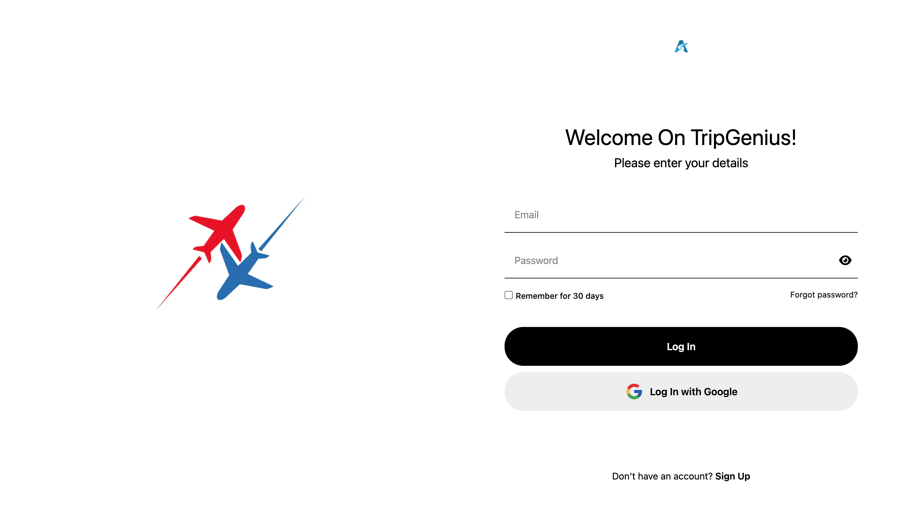
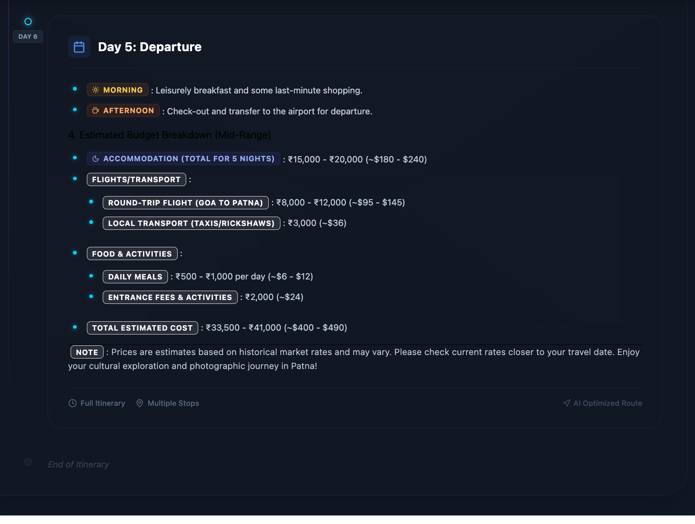

```md
# 🌍 VisaVersa AI — Smart Travel & Visa Intelligence Platform ✈️🤖

> **Hackathon Project** — An end-to-end AI-powered platform that combines  
**secure authentication**, **intelligent travel planning**, and **AI-driven visa & IELTS analysis**  
using **MERN Stack + Python (FastAPI) + LLMs**.

---

## 🔥 Live Demo

🚀 **Frontend (Vercel):**  
👉 https://your-vercel-live-link.vercel.app

📡 **APIs:**
- Node Auth API: `http://localhost:3000`
- Python AI API: `http://localhost:8000`

---

## 🖼️ Screenshots

### 🔐 Authentication (MERN Stack)
<p align="center">
  
  
  
</p>

### 🤖 AI Visa & IELTS Analyzer
<p align="center">
  
  
</p>

### 🌍 AI Travel Planner
<p align="center">
  
  
</p>

---

## 🧠 What Problem Does It Solve?

- ❌ Confusing visa requirements  
- ❌ Manual IELTS evaluation  
- ❌ Poor travel planning tools  
- ❌ Fragmented platforms  

✅ **VisaVersa AI** solves this with:
- Secure authentication
- AI-based document understanding
- Smart travel itineraries
- Auto-generated visa decision insights

---

## 🏗️ Architecture Overview

```

Frontend (React + Tailwind)
|
├── Node.js Backend (Auth, Users, History)
|
└── Python FastAPI Backend
├── AI Travel Planner (LLM)
└── Visa & IELTS Analyzer (PDF + LLM)

```

---

## ✨ Core Features

### 🔐 MERN Authentication System
- JWT-based Login & Registration
- Secure protected routes
- MongoDB user storage
- Auto session handling

### 🌍 AI Travel Planner (Python)
- LLM-generated itineraries
- Budget-aware planning
- Cultural & food recommendations
- Day-wise schedule generation
- Cached responses for performance

### 🛂 AI Visa & IELTS Analyzer
- Upload IELTS PDF
- Auto score extraction
- Eligibility decision (Recommended / Review / Rejected)
- AI-generated reasoning
- Downloadable approval letter (PDF)

---

## 🛠️ Tech Stack

### Frontend
- React.js
- Tailwind CSS
- Axios / Fetch
- jsPDF
- Lucide Icons

### Backend (Node.js)
- Node.js
- Express.js
- MongoDB
- JWT Authentication

### Backend (Python)
- FastAPI
- LangChain
- OpenAI (GPT-4o-mini)
- PyPDF2
- CrewAI (Travel Planning)
- python-dotenv

---

## 📁 Project Structure

```

VisaVersaAi/
│
├── client/                     # React Frontend
│   ├── src/
│   │   └── assets/             # Images for README & UI
│
├── server/                     # Node.js Backend (Auth)
│
├── AI-Travel-Agent-Advanced/   # Python Backend
│   ├── main.py
│   ├── visa_agent.py
│   ├── trip.py
│   ├── debug_api.py
│   ├── requirements.txt
│
└── README.md

````

---

## 🚀 Getting Started (Local Setup)

---

### 1️⃣ Frontend (React)

```bash
cd client
npm install
npm run dev
````

Frontend runs at:

```
http://localhost:5173
```

---

### 2️⃣ Node.js Backend (Auth)

```bash
cd server
npm install
npm start
```

#### `.env` (Node.js)

```env
MONGO_URI=your_mongodb_connection_string
JWT_SECRET=your_jwt_secret
```

Runs at:

```
http://localhost:3000
```

---

### 3️⃣ Python Backend (AI Services)

```bash
cd AI-Travel-Agent-Advanced
python3 -m venv venv
source venv/bin/activate
pip install -r requirements.txt
python main.py
```

#### `.env` (Python)

```env
OPENAI_API_KEY="your_openai_key"
GOOGLE_API_KEY="your_google_key"
SERPER_API_KEY="your_serper_key"
```

Runs at:

```
http://localhost:8000
```

---

## 🔎 API Endpoints

### Travel Planner

```
POST /api/plan-trip
```

### Visa & IELTS Analyzer

```
POST /api/assess-visa-upload
```

---

## 🧪 Hackathon Highlights

* 🔥 Real-world problem
* 🤖 Strong AI integration
* 🧱 Clean architecture
* ⚡ Fast responses with caching
* 🎨 Polished UI
* 📄 Auto-generated official documents

---

## 📞 Contact & Team

👨‍💻 **Sukhdev Singh**
AI Engineer | Full-Stack Developer

* 🔗 GitHub: [https://github.com/Sukhdevsingh123](https://github.com/Sukhdevsingh123)
* 💼 LinkedIn: [https://www.linkedin.com/in/your-linkedin](https://www.linkedin.com/in/your-linkedin)
* 📧 Email: [your-email@example.com](mailto:your-email@example.com)

---

## 🏁 Future Scope

* Multi-language visa support
* OCR fallback for scanned PDFs
* Mobile app
* Real-time embassy rule updates
* Payment & booking integrations

---

## 🏆 Hackathon Ready

> **VisaVersa AI** is designed to impress judges with:
>
> * Clear value
> * Technical depth
> * AI innovation
> * Production-grade thinking

---

⭐ **If you like this project, give it a star and support innovation!**

```

---

If you want next, I can:
- 🎨 Customize README theme for **Devpost / MLH**
- 🏆 Add **Hackathon pitch section**
- 📽️ Create **demo script**
- 📊 Add **architecture diagram**

Just tell me 👌
```
